# Backend Architecture Analysis

## Table of Contents
1. [Executive Summary](#executive-summary)
2. [Technology Stack](#technology-stack)
3. [Architecture Overview](#architecture-overview)
4. [Core Components](#core-components)
5. [Database Schema](#database-schema)
6. [Service Architecture](#service-architecture)
7. [AREA Engine Workflow](#area-engine-workflow)
8. [API Routes](#api-routes)
9. [Authentication & Security](#authentication--security)
10. [Deployment Architecture](#deployment-architecture)
11. [Integration Patterns](#integration-patterns)
12. [Code Quality & Testing](#code-quality--testing)

---

## Executive Summary

This backend is a sophisticated **Action-Reaction Automation System** (AREA) built with **FastAPI** and **PostgreSQL**. It enables users to create automation workflows by connecting triggers (actions) from one service to automated responses (reactions) in another service.

**Key Features:**
- 🔄 **AREA Engine**: Continuous polling system that checks and executes automations
- 🔌 **18+ Service Integrations**: Email, Timer, Webhook, GitHub, Discord, Spotify, Reddit, Twitter, and more
- 🔐 **OAuth2 Authentication**: Support for Google, GitHub, and service-specific OAuth
- 📡 **Webhook Support**: Push-based triggers for real-time automation
- 🎯 **Preset Applets**: Pre-configured automation templates
- ⚡ **Async Architecture**: Built on asyncio for high-performance concurrency

---

## Technology Stack


### Dependencies
- **FastAPI 0.104.1**: Modern, fast web framework
- **SQLAlchemy 2.0.23**: Async ORM with type hints
- **Asyncpg 0.29.0**: High-performance PostgreSQL driver
- **Alembic 1.13.1**: Database migration tool
- **Authlib 1.3.0**: OAuth2 client library
- **Discord.py 2.3.2**: Discord bot integration
- **AIOHTTP 3.9.1**: Async HTTP client
- **Pydantic 2.5.0**: Data validation using Python type annotations

---

## Architecture Overview


---

## Core Components

### 1. Main Application (`app/main.py`)

The entry point of the application with lifespan management:

```python
# Key Features:
- Lifespan Events: Starts/stops AREA engine automatically
- CORS Configuration: Multi-origin support
- Router Registration: Auth, AREA, OAuth routes
- Health Checks: /health and /about.json endpoints
```

**Startup Flow:**


### 2. Database Layer (`app/database.py`)

Async PostgreSQL connection with SQLAlchemy:

```python
# Architecture:
- Async Engine: create_async_engine for non-blocking I/O
- Session Management: AsyncSession with context managers
- Base Models: Timestamp tracking (created_at, updated_at)
- Connection Pooling: Automatic connection lifecycle
```

**Database Connection Flow:**


### 3. AREA Engine (`app/services/area_engine.py`)

The heart of the automation system - continuously monitors and executes AREAs.

**Engine Architecture:**


**Key Methods:**
- `start()`: Initializes engine and starts checking loop
- `stop()`: Gracefully shuts down engine
- `_check_all_areas()`: Main loop - fetches and processes all active AREAs
- `_process_area()`: Checks action trigger and executes reaction
- `trigger_area_manually()`: Manual trigger (testing/webhooks)

**Engine State Machine:**


### 4. Service Registry (`app/services/service_registry.py`)

Central registry managing all service integrations:

```python
# Registered Services (18 total):
- email_service
- timer_service
- webhook_service
- weather_service
- github_service
- spotify_service
- dailymotion_service
- todoist_service
- telegram_service
- trello_service
- reddit_service
- twitter_service
- notion_service
- unsplash_service
- dropbox_service
- google_drive_service
- discord_service
- twitch_service
```

**Service Registration Flow:**


---

## Database Schema


### Model Details

#### Area Model (`app/models/area.py`)
```python
class Area:
    - user_id: Foreign key to users table
    - name: AREA name (max 100 chars)
    - description: Optional description
    
    # Action Configuration
    - action_service: Service ID (e.g., "timer", "github")
    - action_type: Action type (e.g., "interval", "push")
    - action_config: JSON dict with action parameters
    
    # Reaction Configuration
    - reaction_service: Service ID (e.g., "email", "discord")
    - reaction_type: Reaction type (e.g., "send_email")
    - reaction_config: JSON dict with reaction parameters
    
    # Status & Tracking
    - is_active: Enable/disable AREA
    - last_triggered: Last execution timestamp
    - trigger_count: Number of times triggered
```

**AREA Lifecycle:**


---

## Service Architecture

### Base Service Structure (`app/services/base_service.py`)

Abstract base class enforcing consistent service implementation:


### Service Definition Structures (`app/services/base_structures.py`)

```python
# Core Structures:
- ServiceInfo: Service metadata (name, id, OAuth requirement)
- ActionDefinition: Trigger definition (id, name, parameters, type)
- ReactionDefinition: Response definition (id, name, parameters)
- Parameter: Configuration parameter (name, type, required, validation)
- ParameterType: Enum (string, integer, boolean, email, url, select)
```

### Service Implementation Example: Timer Service


**Timer Service Actions:**
1. **Interval Trigger**: Fires every X seconds (minimum 10s)
2. **Daily at Time**: Fires once per day at specific time
3. **Weekdays at Time**: Fires Mon-Fri at specific time

**Timer Service Reactions:**
1. **Delay**: Wait X seconds before continuing

---

## AREA Engine Workflow

### Complete AREA Execution Flow

```mermaid
sequenceDiagram
    participant User
    participant API
    participant Database
    participant Engine
    participant Service Registry
    participant Action Service
    participant Reaction Service
    participant External API
    
    User->>API: Create AREA
    API->>Service Registry: Validate services
    Service Registry-->>API: Valid ✓
    API->>Database: Save AREA
    Database-->>API: AREA created
    API-->>User: AREA ID + config
    
    loop Every 10 seconds
        Engine->>Database: Fetch active AREAs
        Database-->>Engine: List of AREAs
        
        Engine->>Service Registry: Get action service
        Service Registry-->>Engine: Action service instance
        
        Engine->>Action Service: check_action_trigger(config)
        Action Service->>External API: Check condition
        External API-->>Action Service: Status/data
        
        alt Triggered
            Action Service-->>Engine: (True, trigger_data)
            Engine->>Service Registry: Get reaction service
            Service Registry-->>Engine: Reaction service
            Engine->>Reaction Service: execute_reaction(trigger_data)
            Reaction Service->>External API: Perform action
            External API-->>Reaction Service: Success
            Reaction Service-->>Engine: (True, None)
            Engine->>Database: Update statistics
        else Not triggered
            Action Service-->>Engine: (False, None)
        end
    end
```



### Push vs Poll Trigger Types


### Error Handling Flow


---

## API Routes

### Route Structure


### Authentication Flow


### OAuth2 Integration Flow


### Webhook Endpoint Flow


---

## Authentication & Security

### JWT Token Structure


### Security Measures

```python
# 1. Password Hashing
- Algorithm: bcrypt
- Work factor: Configurable (default 12)
- Salt: Automatic per-password

# 2. JWT Security
- Secret key: Environment variable (SECRET_KEY)
- Algorithm: HS256
- Expiration: Access (15 min), Refresh (7 days)
- Claims validation: exp, sub

# 3. OAuth2 Security
- PKCE flow support
- State parameter validation
- Token encryption in database
- Automatic token refresh

# 4. Webhook Security
- Optional secret verification
- Header-based auth (X-Webhook-Secret)
- HMAC signature validation option

# 5. CORS Configuration
- Configurable allowed origins
- Credentials support
- Pre-flight caching
```

### Password Flow


---

## Deployment Architecture

### Docker Compose Stack

```mermaid
graph TB
    subgraph "Docker Network"
        subgraph "Backend Container"
            FASTAPI[FastAPI App<br/>Port 8080]
            ENGINE[AREA Engine]
            DISCORD_BOT[Discord Bot Listener]
        end
        
        subgraph "Database Container"
            POSTGRES[PostgreSQL<br/>Port 5432]
        end
        
        subgraph "Admin Container"
            PGADMIN[PgAdmin<br/>Port 5050]
        end
        
        FASTAPI <--> POSTGRES
        DISCORD_BOT <--> POSTGRES
        PGADMIN <--> POSTGRES
        ENGINE <--> POSTGRES
    end
    
    subgraph "External"
        CLIENT[Web/Mobile Client] --> FASTAPI
        WEBHOOKS[External Webhooks] --> FASTAPI
        DISCORD_API[Discord API] <--> DISCORD_BOT
    end
    
    style FASTAPI fill:#009688
    style POSTGRES fill:#336791
    style ENGINE fill:#FF6B35
```

### Container Startup Sequence

```mermaid
sequenceDiagram
    participant Docker Compose
    participant PostgreSQL
    participant Backend
    participant Alembic
    participant FastAPI
    participant AREA Engine
    
    Docker Compose->>PostgreSQL: Start database container
    PostgreSQL-->>PostgreSQL: Initialize database
    
    Docker Compose->>Backend: Start backend container
    Backend->>Backend: Execute startup.sh
    Backend->>PostgreSQL: Wait for ready (pg_isready)
    
    loop Until PostgreSQL ready
        Backend->>PostgreSQL: Check connection
    end
    
    Backend->>Alembic: Run migrations
    Alembic->>PostgreSQL: Apply schema changes
    PostgreSQL-->>Alembic: Migrations complete
    
    Backend->>FastAPI: Start Uvicorn server
    FastAPI->>FastAPI: Load routes
    FastAPI->>AREA Engine: Start engine (lifespan)
    AREA Engine-->>FastAPI: Engine running
    FastAPI-->>Backend: Server ready :8080
```

### Environment Configuration

```python
# Critical Environment Variables:

# Database
DATABASE_URL=postgresql+asyncpg://user:pass@db:5432/backend_db

# Security
SECRET_KEY=<secure-random-key>
ACCESS_TOKEN_EXPIRE_MINUTES=15
REFRESH_TOKEN_EXPIRE_DAYS=7

# CORS
CORS_ORIGINS=http://localhost:3000,http://localhost:8080

# OAuth Providers
GOOGLE_CLIENT_ID=<google-client-id>
GOOGLE_CLIENT_SECRET=<google-secret>
GITHUB_CLIENT_ID=<github-client-id>
GITHUB_CLIENT_SECRET=<github-secret>

# Service-specific
DISCORD_BOT_TOKEN=<discord-bot-token>
BASE_URL=http://localhost:8080

# Deployment
APP_ENV=dev  # dev | prod
RUN_MIGRATIONS=true
```

---

## Integration Patterns

### Service Integration Types

```mermaid
graph TB
    subgraph "Polling Services"
        TIMER[Timer<br/>Interval checks]
        EMAIL[Email<br/>IMAP polling]
        WEATHER[Weather<br/>API polling]
    end
    
    subgraph "Webhook Services"
        GITHUB[GitHub<br/>Webhooks]
        DISCORD_TXT[Discord<br/>Bot events]
        TELEGRAM[Telegram<br/>Bot updates]
    end
    
    subgraph "OAuth Services"
        SPOTIFY[Spotify<br/>OAuth2 + API]
        GOOGLE_DRIVE[Google Drive<br/>OAuth2 + API]
        REDDIT[Reddit<br/>OAuth2 + API]
        TWITTER[Twitter<br/>OAuth2 + API]
    end
    
    subgraph "Hybrid Services"
        TRELLO[Trello<br/>OAuth + Webhooks]
        NOTION[Notion<br/>OAuth + Polling]
    end
    
    ENGINE[AREA Engine] --> TIMER
    ENGINE --> EMAIL
    ENGINE --> WEATHER
    
    WEBHOOK_EP[Webhook Endpoints] --> GITHUB
    WEBHOOK_EP --> DISCORD_TXT
    WEBHOOK_EP --> TELEGRAM
    
    ENGINE --> SPOTIFY
    ENGINE --> GOOGLE_DRIVE
    ENGINE --> REDDIT
    ENGINE --> TWITTER
    
    ENGINE --> TRELLO
    ENGINE --> NOTION
    WEBHOOK_EP --> TRELLO
    
    style ENGINE fill:#FF6B35
    style WEBHOOK_EP fill:#4CAF50
```

### Discord Bot Integration

```mermaid
sequenceDiagram
    participant Discord API
    participant Discord Bot
    participant Backend API
    participant Database
    participant AREA Engine
    
    Discord API->>Discord Bot: Event (message, reaction, join)
    Discord Bot->>Discord Bot: Process event
    Discord Bot->>Backend API: GET /api/internal/areas/find<br/>?action_service=discord<br/>&action_type=new_message<br/>&channel_id=123
    Backend API->>Database: Query matching AREAs
    Database-->>Backend API: List of AREA IDs
    Backend API-->>Discord Bot: {area_ids: [1, 2, 3]}
    
    loop For each AREA ID
        Discord Bot->>Backend API: POST /webhooks/{area_id}<br/>Event payload
        Backend API->>AREA Engine: trigger_area_manually()
        AREA Engine->>AREA Engine: Execute reaction
        AREA Engine-->>Backend API: Success
        Backend API-->>Discord Bot: {status: "triggered"}
    end
```

### Preset Applet System

```mermaid
graph TD
    A[User] --> B[Browse Applets]
    B --> C[Select Applet]
    C --> D[Review Configuration]
    D --> E[Create AREA]
    
    E --> F[Replace Placeholders]
    F --> G[Generate Secrets]
    G --> H[Validate Services]
    H --> I[Save to Database]
    I --> J[Return AREA Object]
    
    K[Preset Definitions] --> C
    
    style E fill:#2196F3
    style J fill:#4CAF50
    
    L["Placeholders:<br/>{user_email}<br/>{user_name}<br/>{auto-generated-secret}"] --> F
```

---

## Code Quality & Testing

### Testing Architecture

```mermaid
graph TB
    subgraph "Test Types"
        UNIT[Unit Tests<br/>Individual components]
        INT[Integration Tests<br/>Service interactions]
        E2E[End-to-End Tests<br/>Full workflows]
    end
    
    subgraph "Test Files"
        T1[test_area_system.py]
        T2[test_timer_area.py]
        T3[test_webhook_integration.py]
        T4[tests/test_area_engine_unit.py]
        T5[tests/test_email_service_unit.py]
        T6[tests/test_oauth_endpoints.py]
    end
    
    UNIT --> T4
    UNIT --> T5
    INT --> T1
    INT --> T2
    INT --> T6
    E2E --> T3
    
    style UNIT fill:#4CAF50
    style INT fill:#2196F3
    style E2E fill:#FF6B35
```

### Test Coverage

```python
# Test Scripts:
1. test_area_system.py
   - Service registry validation
   - Email service functionality
   - Timer service functionality
   - AREA engine lifecycle

2. test_timer_area.py
   - Timer service actions (interval, daily, weekdays)
   - Trigger timing validation
   - Example AREA creation

3. test_webhook_integration.py
   - Webhook AREA creation
   - Webhook trigger validation
   - Secret authentication
   - Invalid webhook handling

# Pytest Configuration (pytest.ini):
- Test discovery patterns
- Async test support (pytest-asyncio)
- Coverage reporting
```

### Code Structure Quality

```mermaid
graph LR
    A[Code Quality] --> B[Type Hints]
    A --> C[Async/Await]
    A --> D[Error Handling]
    A --> E[Logging]
    
    B --> B1[Pydantic Models]
    B --> B2[SQLAlchemy Type Hints]
    B --> B3[Function Signatures]
    
    C --> C1[Async Services]
    C --> C2[Async Database]
    C --> C3[Async Engine]
    
    D --> D1[Try/Except Blocks]
    D --> D2[Custom Exceptions]
    D --> D3[Validation Errors]
    
    E --> E1[Structured Logging]
    E --> E2[Log Levels]
    E --> E3[Request Tracking]
    
    style A fill:#FF6B35
    style B1 fill:#4CAF50
    style C1 fill:#2196F3
    style D1 fill:#FFC107
```

---

## System Statistics

### Integrated Services Summary

| Service | Actions | Reactions | OAuth Required | Trigger Type |
|---------|---------|-----------|----------------|--------------|
| Timer | 3 | 1 | No | Poll |
| Webhook | 2 | 0 | No | Push |
| Email | 1 | 1 | No | Poll |
| Weather | 1 | 0 | No | Poll |
| GitHub | 5 | 4 | Yes | Hybrid |
| Discord | 3 | 2 | Yes | Push |
| Spotify | 4 | 3 | Yes | Poll |
| Reddit | 3 | 2 | Yes | Poll |
| Twitter | 3 | 2 | Yes | Hybrid |
| Telegram | 2 | 1 | No | Push |
| Todoist | 3 | 2 | Yes | Poll |
| Trello | 3 | 2 | Yes | Hybrid |
| Notion | 2 | 2 | Yes | Poll |
| Google Drive | 3 | 2 | Yes | Poll |
| Dropbox | 2 | 2 | Yes | Poll |
| Unsplash | 1 | 0 | Yes | Poll |
| Dailymotion | 2 | 1 | Yes | Poll |
| Twitch | 2 | 0 | Yes | Poll |

**Total: 18 Services, 44+ Actions, 27+ Reactions**

### Performance Metrics

```mermaid
graph LR
    subgraph "Response Times"
        A1[Health Check<br/>< 5ms]
        A2[AREA Creation<br/>< 100ms]
        A3[AREA Listing<br/>< 50ms]
    end
    
    subgraph "Engine Performance"
        B1[Check Cycle<br/>10 seconds]
        B2[Concurrent Processing<br/>Non-blocking]
        B3[Database Queries<br/>Async + Indexed]
    end
    
    subgraph "Scalability"
        C1[Horizontal Scaling<br/>Stateless API]
        C2[Database Connection Pool<br/>Auto-managed]
        C3[Docker Deployment<br/>Easy replication]
    end
    
    style A1 fill:#4CAF50
    style B2 fill:#2196F3
    style C1 fill:#FF6B35
```

---

## Key Design Patterns

### 1. Strategy Pattern (Service Architecture)
Each service implements the same interface but with different behavior:
```python
BaseService (interface)
├── TimerService (strategy 1)
├── EmailService (strategy 2)
└── WebhookService (strategy 3)
```

### 2. Registry Pattern (Service Registry)
Central registry for managing service instances:
```python
ServiceRegistry
├── register_service()
├── get_service()
└── list_services()
```

### 3. Observer Pattern (AREA Engine)
Engine observes changes in data and triggers reactions:
```python
AREA Engine (observer)
├── Monitors database (subject)
├── Checks action triggers
└── Executes reactions
```

### 4. Factory Pattern (AREA Creation)
Applets act as factories for creating pre-configured AREAs:
```python
Applet Template
├── Defines configuration
├── Validates services
└── Creates AREA instance
```

### 5. Dependency Injection
FastAPI's dependency system for database sessions and auth:
```python
async def endpoint(
    db: Session = Depends(get_db),
    user: User = Depends(get_current_user)
)
```

---

## Architecture Decisions

### Why FastAPI?
- ✅ Native async/await support
- ✅ Automatic OpenAPI documentation
- ✅ Pydantic validation out of the box
- ✅ High performance (comparable to Node.js)
- ✅ Type hints and IDE support

### Why PostgreSQL?
- ✅ ACID compliance for data integrity
- ✅ JSON/JSONB support for flexible config storage
- ✅ Excellent async driver (asyncpg)
- ✅ Rich query capabilities
- ✅ Reliable for production workloads

### Why Polling Engine (10s interval)?
- ✅ Simple implementation
- ✅ Works with any service (no webhook setup needed)
- ✅ Predictable resource usage
- ⚠️ Trade-off: 10s latency vs. real-time
- 🔄 Hybrid approach: Webhooks for real-time + polling for others

### Why Abstract Base Service?
- ✅ Enforces consistent interface
- ✅ Easy to add new services
- ✅ Built-in validation
- ✅ Reduces code duplication

---

## Future Enhancements

```mermaid
mindmap
  root((Future Plans))
    Performance
      Caching Layer
      Queue System
      Rate Limiting
      Load Balancing
    Features
      AREA Templates
      Conditional Logic
      Multi-step Workflows
      AREA Sharing
    Monitoring
      Metrics Dashboard
      Error Tracking
      Usage Analytics
      Health Monitoring
    Services
      More Integrations
      Custom Services
      API Marketplace
      Service Discovery
```

### Potential Improvements

1. **Message Queue Integration**
   - Replace polling with event-driven architecture
   - Use RabbitMQ or Redis for queue
   - Better scalability for high-volume AREAs

2. **Caching Layer**
   - Redis for session storage
   - Cache OAuth tokens
   - Cache service responses
   - Reduce database load

3. **Enhanced AREA Engine**
   - Conditional logic (if/else)
   - Multi-reaction chains
   - AREA groups and dependencies
   - Scheduled execution windows

4. **Monitoring & Observability**
   - Prometheus metrics
   - Grafana dashboards
   - Sentry error tracking
   - Request tracing

5. **API Versioning**
   - Version routes (/v1/areas)
   - Backward compatibility
   - Deprecation warnings
   - Migration guides

---

## Conclusion

This backend implementation represents a robust, scalable automation platform with:

✅ **Solid Architecture**: Clean separation of concerns, abstract interfaces, and clear data flow

✅ **Modern Stack**: FastAPI, async PostgreSQL, Docker containerization

✅ **Extensibility**: Easy to add new services through the BaseService interface

✅ **Security**: JWT authentication, OAuth2 support, webhook verification

✅ **Reliability**: Error handling, logging, database transactions

✅ **Developer Experience**: Type hints, documentation, testing framework

The AREA engine continuously monitors user-configured automations and executes reactions when triggers are detected, supporting both polling and push-based architectures. With 18+ integrated services and a flexible service registry, users can create powerful automation workflows connecting different platforms and APIs.

---

## Appendix: Quick Reference

### Common AREA Examples

```python
# Example 1: Timer → Email
{
  "action_service": "timer",
  "action_type": "interval",
  "action_config": {"interval_seconds": 60},
  "reaction_service": "email",
  "reaction_type": "send_email",
  "reaction_config": {
    "to_email": "user@example.com",
    "subject": "Timer Alert",
    "body": "Triggered at {triggered_at}"
  }
}

# Example 2: Webhook → Discord
{
  "action_service": "webhook",
  "action_type": "generic",
  "action_config": {"webhook_secret": "secret123"},
  "reaction_service": "discord",
  "reaction_type": "send_message",
  "reaction_config": {
    "channel_id": "123456789",
    "message": "Webhook triggered: {webhook_payload}"
  }
}

# Example 3: GitHub → Email
{
  "action_service": "github",
  "action_type": "new_issue",
  "action_config": {"repo": "owner/repo"},
  "reaction_service": "email",
  "reaction_type": "send_email",
  "reaction_config": {
    "to_email": "dev@example.com",
    "subject": "New GitHub Issue: {issue_title}",
    "body": "{issue_body}"
  }
}
```

### API Endpoint Cheatsheet

```bash
# Authentication
POST /api/auth/register
POST /api/auth/login
POST /api/auth/refresh

# Services Discovery
GET /api/services
GET /api/services/{service_id}/actions
GET /api/services/{service_id}/reactions

# AREA Management
POST /api/areas
GET /api/areas
GET /api/areas/{id}
PUT /api/areas/{id}
DELETE /api/areas/{id}
POST /api/areas/{id}/trigger

# Applets
GET /api/applets
POST /api/applets/{id}/create

# Webhooks
POST /webhooks/{area_id}
POST /webhooks/telegram

# OAuth
GET /api/oauth/{service}/authorize
GET /api/oauth/{service}/callback

# Health & Info
GET /health
GET /about.json
```

### Database Query Examples

```sql
-- Get all active AREAs for a user
SELECT * FROM areas 
WHERE user_id = 1 AND is_active = true;

-- Get AREA trigger statistics
SELECT 
  name,
  trigger_count,
  last_triggered
FROM areas 
ORDER BY trigger_count DESC 
LIMIT 10;

-- Check OAuth tokens
SELECT 
  u.email,
  ot.service,
  ot.expires_at
FROM oauth_tokens ot
JOIN users u ON u.id = ot.user_id
WHERE ot.expires_at < NOW();
```

---

**Document Version:** 1.0  
**Last Updated:** January 2025  
**Author:** Backend Architecture Team
